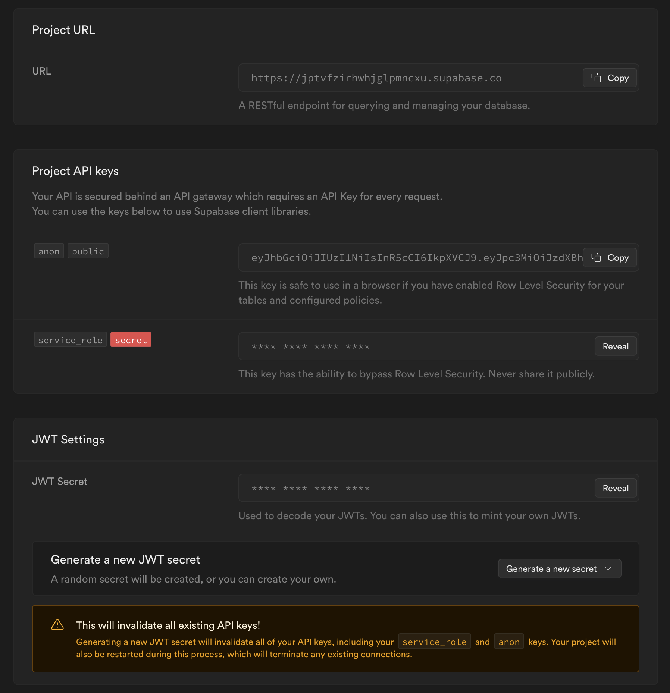

# How to setup Supabase Environment?

To enable social auth, phone verification and another important features, you need several environmental variabes: NEXT_PUBLIC_SUPABASE_URL, NEXT_PUBLIC_SUPABASE_ANON_KEY and JWT_SECRET

## Where can I find them?

First of all, go to [supabase](https://app.supabase.com/) and log in, then you need access to [duckies database](https://app.supabase.com/project/jptvfzirhwhjglpmncxu)

Inside database follow to Settings > API or just by the [link](https://app.supabase.com/project/jptvfzirhwhjglpmncxu). Here you can see three sections with the values:

You are interested in `Project URL`, anon key from the `Project API keys` (first one) and JWT secret from `JWT settings` section

## Where should I put it?

These values should be putted as environmental variables:

- Project URL inside NEXT_PUBLIC_SUPABASE_URL
- Anon key inside NEXT_PUBLIC_SUPABASE_ANON_KEY
- JWT secret inside JWT_SECRET

### Drone CI

For the drone setup use `next_public_supabase_url_uat`, `next_public_supabase_anon_key_uat` and `supabase_jwt_secret_uat` as secret`s keys respectively.
