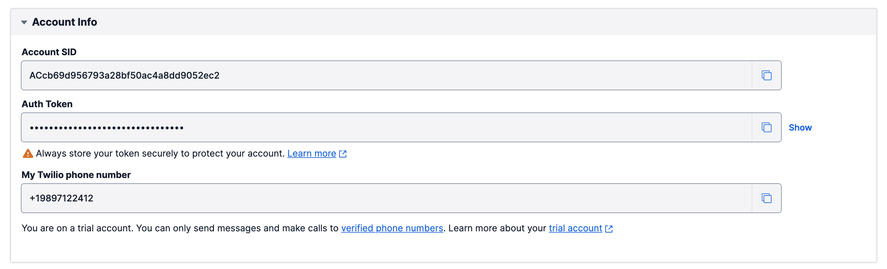

# How to setup Twilio Environment?

To enable [twilio](https://www.twilio.com/) for the phone verification, you need several environmental variabes: TWILIO_ACCOUNT_SID, TWILIO_AUTH_TOKEN and TWILIO_PHONE_NUMBER

## Where can I find them?

First of all, [sign up](https://www.twilio.com/try-twilio) or [log in](https://www.twilio.com/login) (if you already have an account) on twilio.

Follow the instruction until you will be redirected to [console](https://console.twilio.com/). Here you can find Account Info section with all necessary values. 

If something is missing then follow by Twilio instructions to generate it.

You can choose another account or orginization [here](https://www.twilio.com/console/projects/summary) after selecting one of them you will be redirected to console.

## Where should I put it?

These values should be putted as environmental variables:

- `Account SID` inside TWILIO_ACCOUNT_SID
- `Auth Token` inside TWILIO_AUTH_TOKEN
- `My Twilio Phone Number` inside TWILIO_PHONE_NUMBER

### Drone CI

For the drone setup use `twilio_account_sid_uat`, `twilio_auth_token_uat` and `twilio_phone_number_uat` as secret`s keys respectively.
